# GymPin — Notes & Notifications

<div align="center">

[](https://developer.apple.com/ios/)
[](https://swift.org)
[](https://developer.apple.com/xcode/swiftui/)
[](LICENSE)

A modern, feature-rich iOS workout tracking app built with SwiftUI and the MVVM architecture.  
Liquid glass design language throughout. Fully offline. Zero tracking.

[Features](#features) · [Screenshots](#screenshots) · [Installation](#installation) · [Usage](#usage) · [Architecture](#architecture) · [Contributing](#contributing)

</div>

---

## Features

### Exercise Management

- Create, edit, and delete exercises with full detail
- Track individual sets with separate reps and weight values
- Toggle between **kg** and **lb** weight units (auto-converts logged history)
- Add free-form notes and instructions per exercise
- Attach up to **10 photos** per exercise (JPEG and animated GIF supported)
- Swipeable horizontal image gallery with **tap-to-enlarge full-screen viewer**
- Full-screen viewer supports GIF animation, multi-image paging, and tap-to-dismiss
- Mark sets or zero-set exercises as completed with a single tap
- Previous entry displayed per set for quick reference

### Training Groups

- Organize exercises into custom color-coded training groups
- Assign a single exercise to up to **7 groups** simultaneously
- Built-in "All Exercises" view aggregates every exercise
- Add, edit, delete, and reorder groups freely
- Per-group exercise ordering preserved independently

### Workout Timer and Rest Timer

- Start, pause, and stop a running workout timer from any group view
- One-tap rest timer presets: **1 min**, **3 min**, **5 min**
- On-screen overlay and local notification when rest time completes
- Timers persist across tab switches within the session

### Calendar and Day Planning

- Collapsible calendar section on the main dashboard with today's planned groups
- Full monthly calendar with horizontal date picker
- Drag-and-drop group assignment: drag a training group onto any calendar date
- Eraser mode to clear assignments with a single tap
- Color-coded dot indicators show planned groups per date

### Stats Overview

- Dashboard cards for **Today**, **Week**, **Month**, and **Overall** total volume (reps × weight)
- Weekly activity bar chart (Monday–Sunday)
- Supplement split stacked column chart by weekday
- Daily goal gauge with multi-segment progress ring
- All stats respect the current weight unit and update in real time

### Supplements Reminder

- Create named supplement reminders with optional notes
- Flexible repeat rules: **Daily**, **Weekly**, **Monthly**, or **Custom** (every N days for M days)
- Per-reminder enable/disable toggle
- Local notifications with configurable sound

### Motivational Quotes

- Daily "Quote of the Day" alert on app launch
- Curated library of 150+ motivational quotes
- Thumbs-up to dismiss; thumbs-down to permanently hide a quote
- One quote per day, never repeated until the full library cycles

### Customization and Settings

- Appearance mode: **System**, **Light**, or **Dark**
- Weight unit: **kg** or **lb** (applies globally)
- Scheduled workout reminder with custom time and message
- Supplement reminder sound toggle
- Quote of the Day toggle
- Notification authorization management

### Drag and Drop

- Long-press and drag to reorder exercises within any group tab
- Long-press and drag training group tabs to rearrange their order
- Drag groups onto calendar dates in the Day Planning view
- All ordering preferences saved automatically

### Design

- **Liquid glass** design language: ultra-thin material backgrounds, gradient strokes, layered shadows
- Consistent styling across every screen and component
- Smooth spring animations and transitions throughout

### Privacy and Offline

- All data stored locally on-device (JSON files + image directory)
- No cloud sync, no analytics, no network requests
- Photo library access requested only when attaching images
- Works entirely offline

---

## Screenshots

### Dashboard
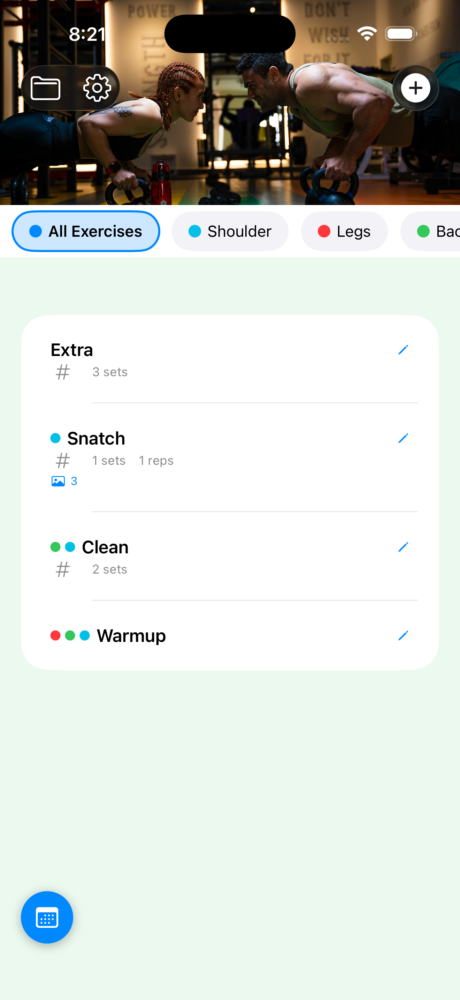

*Main dashboard with workout programs, calendar, and stats overview*

### Training Groups
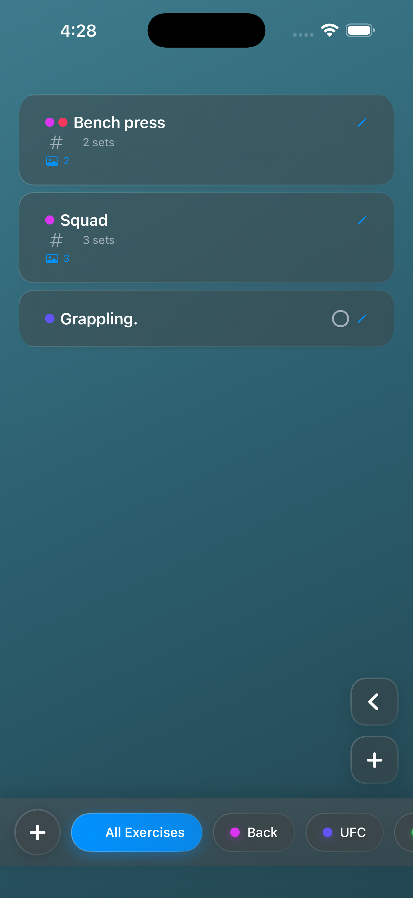

*Create, manage, and organize training groups with custom colors*

### Exercise Detail
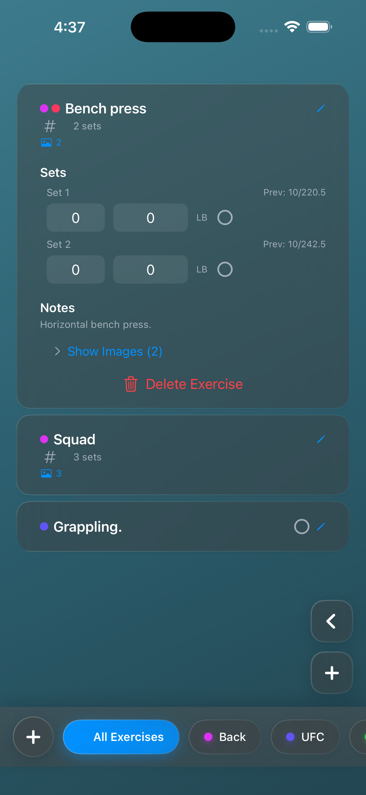

*Add or edit an exercise with sets, images, and notes*

### Exercise List
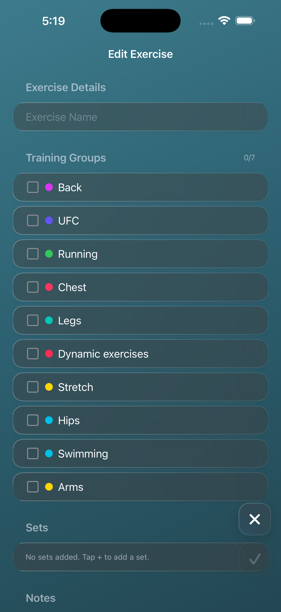

*Exercise list with group tabs, inline set editing, and completion checkmarks*

### Full-Screen Image Viewer
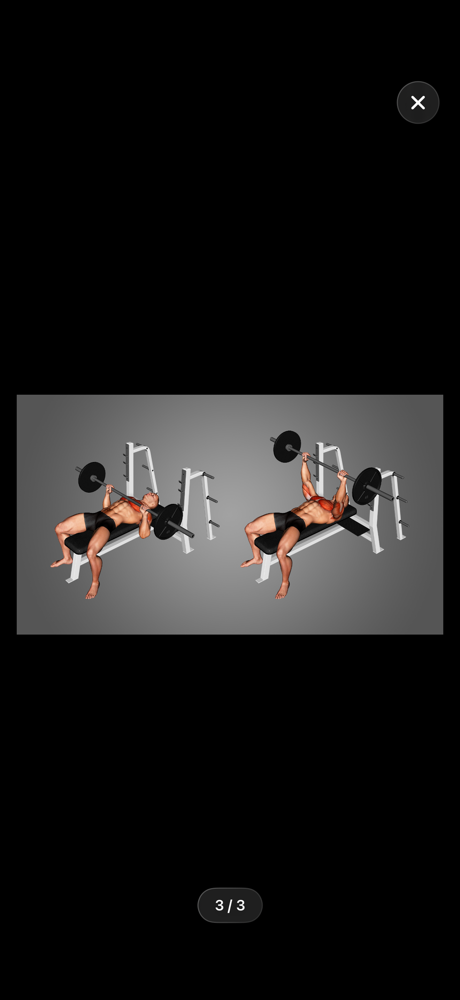

*Tap any image thumbnail to view full-screen with swipe paging and GIF support*

### Workout Group with Timers
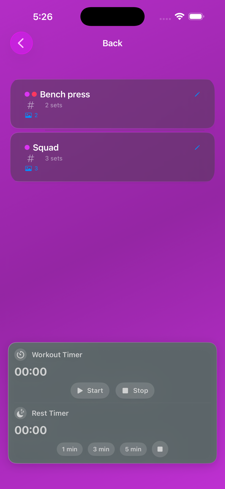

*Group-specific exercise list with workout timer and rest timer presets*

### Day Planning
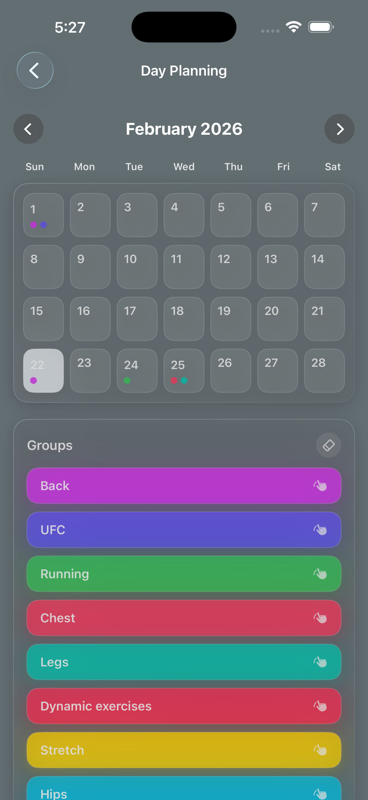

*Monthly calendar with drag-and-drop group assignment and eraser mode*

### Calendar Section
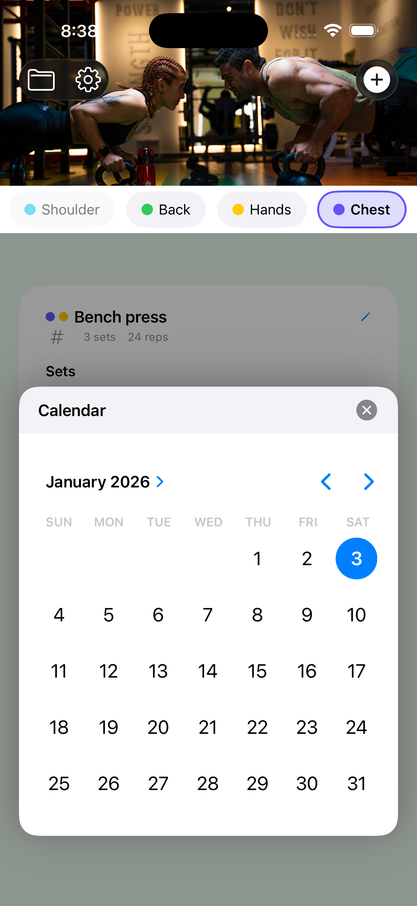

*Expandable calendar with date picker and planned group indicators*

### Supplements Reminder
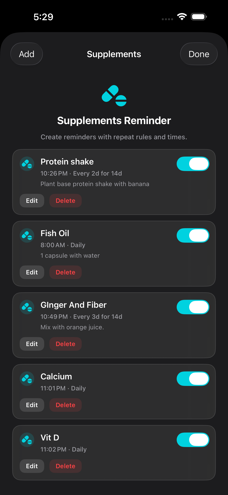

*Create supplement reminders with flexible repeat rules and notifications*

### Settings
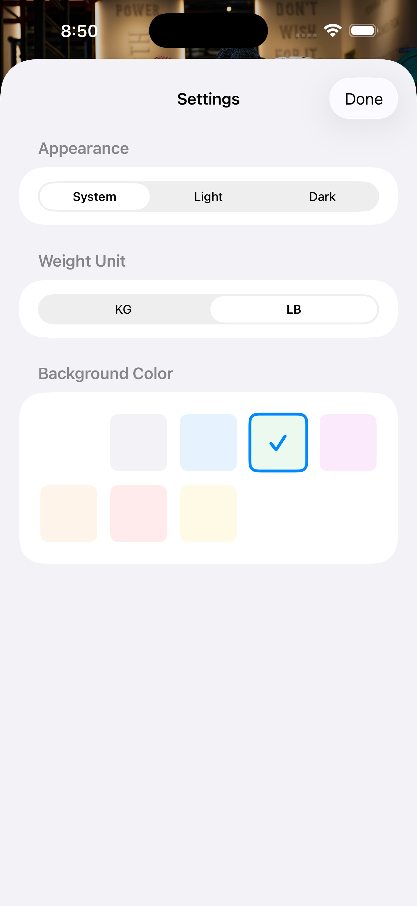

*Appearance mode, weight unit, workout reminder, and notification preferences*

### Quote of the Day
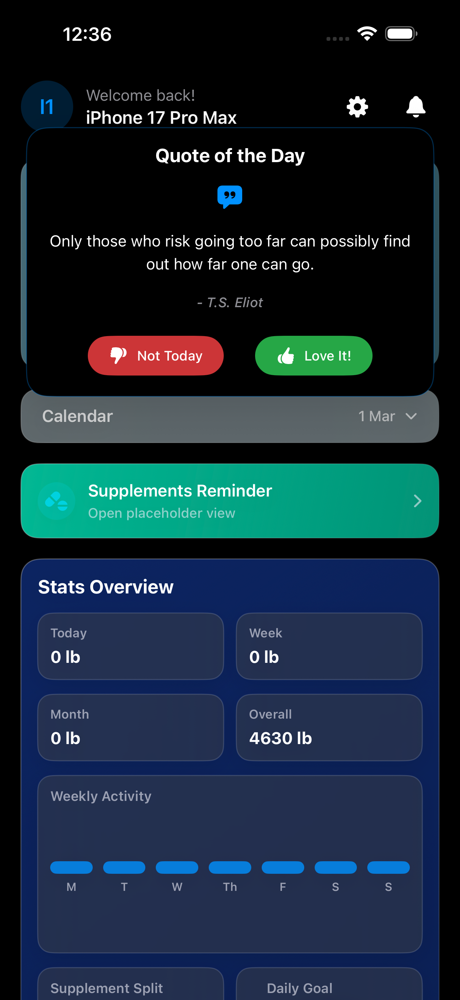

*Daily motivational quote with thumbs-up and thumbs-down actions*

---

## Requirements

| Requirement | Minimum Version |
|-------------|-----------------|
| iOS         | 17.0            |
| Xcode       | 15.0            |
| Swift       | 5.9             |
| Device      | iPhone (optimized for iPhone 12 and newer) |

---

## Installation

### Option 1: Clone and Run in Simulator

```bash
git clone https://github.com/jasur-py/gym_menu.git
cd gym_menu
open GymPlanner/GymPlanner.xcodeproj
```

Select a simulator (e.g. iPhone 15 Pro) and press **Cmd + R** to build and run.

### Option 2: Install on a Physical Device

1. Open `GymPlanner/GymPlanner.xcodeproj` in Xcode.
2. Connect your iPhone via USB.
3. Select your device from the device selector.
4. Under **Signing & Capabilities**, choose your Apple Developer team and set a unique Bundle Identifier (e.g. `com.yourname.GymPlanner`).
5. On your iPhone, go to **Settings > General > VPN & Device Management**, tap your Apple ID, and select **Trust** (first time only).
6. Press **Cmd + R** to build and run.

---

## Usage

### Getting Started

1. Launch the app — the main dashboard appears with the Workout Programs card, calendar, and stats.
2. Tap the **Workout Programs** card or a specific group pill to enter the exercise list.
3. Tap **+** to create a new training group, then **+** again to add your first exercise.

### Managing Exercises

| Action         | How                                                    |
|----------------|--------------------------------------------------------|
| Add            | Tap the **+** button in the exercise list              |
| Edit           | Tap the pencil icon on any exercise row                |
| Delete         | Swipe left on a row, or use the delete button expanded |
| Reorder        | Long-press and drag an exercise to a new position      |
| Expand/Collapse| Tap an exercise row to toggle details                  |
| Complete Set   | Tap the circle checkbox next to any set                |
| View Image     | Tap any image thumbnail to open the full-screen viewer |

### Organizing Workouts

- Switch groups using the tab bar at the bottom of the exercise list.
- Tap "All Exercises" to see every exercise across all groups.
- Long-press and drag tabs to reorder training groups.
- Open the Day Planning view from the calendar section to assign groups to dates.

### Settings

Tap the gear icon on the dashboard to open the settings side sheet. From there you can change appearance mode, weight unit, toggle daily quotes, configure workout reminders, and manage supplement reminder sounds.

---

## Architecture

### MVVM (Model–View–ViewModel)

```
┌─────────────────────────────────────────────────────┐
│                      Views                          │
│  SwiftUI components — UI layer                      │
│  NewMainView · ExerciseListView · ExerciseDetailView│
│  WorkoutGroupView · TrainingGroupView               │
│  DayPlanningView · SettingsView                     │
└───────────────────┬─────────────────────────────────┘
                    │ @ObservedObject / @StateObject
                    ▼
┌─────────────────────────────────────────────────────┐
│                   ViewModels                        │
│  Business logic layer                               │
│  ExerciseListViewModel · ExerciseDetailViewModel    │
│  TrainingGroupViewModel                             │
└───────────────────┬─────────────────────────────────┘
                    │ Uses
                    ▼
┌─────────────────────────────────────────────────────┐
│               Models & Services                     │
│  Data layer                                         │
│  Exercise · ExerciseSet · TrainingGroup             │
│  DataPersistenceService · ImageStorageService       │
│  SettingsService · QuoteService                     │
│  SupplementsReminderService                         │
└─────────────────────────────────────────────────────┘
```

### Project Structure

```
gym_menu/
├── GymPlanner/
│   └── GymPlanner.xcodeproj/
├── GymPinApp.swift
├── Models/
│   ├── Exercise.swift
│   ├── ExerciseSet.swift
│   └── TrainingGroup.swift
├── ViewModels/
│   ├── ExerciseListViewModel.swift
│   ├── ExerciseDetailViewModel.swift
│   └── TrainingGroupViewModel.swift
├── Views/
│   ├── NewMainView.swift
│   ├── ContentView.swift
│   ├── ExerciseListView.swift
│   ├── ExerciseDetailView.swift
│   ├── WorkoutGroupView.swift
│   ├── TrainingGroupView.swift
│   ├── DayPlanningView.swift
│   ├── SettingsView.swift
│   ├── AnimatedGIFView.swift
│   └── Components/
│       ├── CollapsibleImageView.swift
│       └── HorizontalImageView.swift
├── Services/
│   ├── DataPersistenceService.swift
│   ├── ImageStorageService.swift
│   ├── SettingsService.swift
│   ├── QuoteService.swift
│   └── SupplementsReminderService.swift
├── Assets/
│   └── AppIcon.appiconset/
├── Screenshots/
└── README.md
```

---

## Data Storage

All data is stored locally in the app's Documents directory:

```
Documents/
├── exercises.json
├── training_groups.json
├── day_schedule.json
├── settings.json
└── Images/
    └── [UUID].jpg | [UUID].gif
```

### Exercise JSON

```json
{
  "id": "UUID",
  "name": "Bench Press",
  "sets": [
    { "reps": 10, "weight": 60.0, "lastLoggedReps": 10, "lastLoggedWeight": 60.0 },
    { "reps": 8, "weight": 70.0, "lastLoggedReps": 8, "lastLoggedWeight": 70.0 }
  ],
  "notes": "Focus on form",
  "imagePaths": ["UUID.jpg", "UUID.gif"],
  "groupIds": ["UUID", "UUID"]
}
```

### Training Group JSON

```json
{
  "id": "UUID",
  "name": "Push Day",
  "colorData": [0.0, 0.5, 1.0, 1.0],
  "exerciseOrder": ["UUID", "UUID", "UUID"]
}
```

---

## Privacy

- All data stays on your device.
- No cloud sync. No analytics. No telemetry.
- Photo library access is requested only when you choose to attach images.
- The app works entirely offline.

---

## Contributing

Contributions are welcome.

1. Fork the repository.
2. Create a feature branch: `git checkout -b feature/your-feature`.
3. Commit your changes: `git commit -m "Add your feature"`.
4. Push the branch: `git push origin feature/your-feature`.
5. Open a Pull Request.

---

## License

This project is licensed under the MIT License. See [LICENSE](LICENSE) for details.

---

## Author

**Jasur Khojiev**

- GitHub: [@jasur-py](https://github.com/jasur-py)
- Repository: [gym_menu](https://github.com/jasur-py/gym_menu)

---

<div align="center">

Built with SwiftUI

[Report a Bug](https://github.com/jasur-py/gym_menu/issues) · [Request a Feature](https://github.com/jasur-py/gym_menu/issues)

</div>
